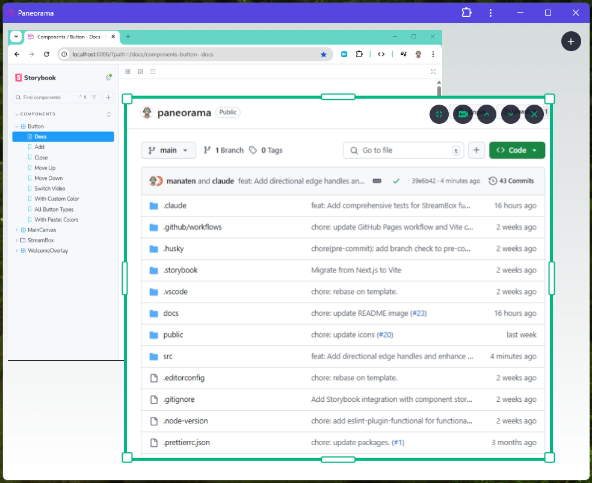

# Paneorama

> A screen pane manager for streaming

https://manaten.github.io/paneorama/

Paneorama is a web-based screen capture management tool designed for presenters using [Screen Capture API](https://developer.mozilla.org/en-US/docs/Web/API/Screen_Capture_API/Using_Screen_Capture). It allows you to capture multiple screens or windows simultaneously and manage them in a flexible, drag-and-drop interface.



## ✨ Features

### 🖥️ Multi-Screen Capture

- Capture multiple screens, windows, or browser tabs simultaneously
- Each stream runs independently with its own controls

### 🎨 Visual Management

- **Drag & Resize**: Freely position and resize capture windows
- **Layer Control**: Adjust stacking order with intuitive up/down buttons

## 🚀 Getting Started

### Prerequisites

- Modern web browser with Screen Capture API support (Chrome, Edge, Firefox)

## 🎮 How to Use

### Basic Operations

1. **Add Screen Capture**
   - Click the `+` button or hover over the main area
   - Select the screen, window, or tab you want to capture
   - The new capture appears as a draggable window

2. **Manage Captures**
   - **Drag**: Click and drag to reposition
   - **Resize**: Drag corners/edges to resize
   - **Layer Control**: Use ↑/↓ buttons to change stacking order
   - **Switch Source**: Use the switch button to change capture source
   - **Close**: Use the ✕ button to remove

## 📝 Development

### Installation

1. Clone the repository:

```bash
git clone https://github.com/manaten/paneorama.git
cd paneorama
```

2. Install dependencies:

```bash
npm install
```

3. Start the development server:

```bash
npm run dev
```

4. Open [http://localhost:3000](http://localhost:3000) in your browser

### Production Build

```bash
npm run build
npm start
```

## 📄 License

This project is licensed under the MIT License - see the [LICENSE](LICENSE) file for details.
